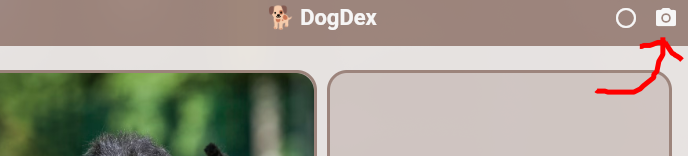
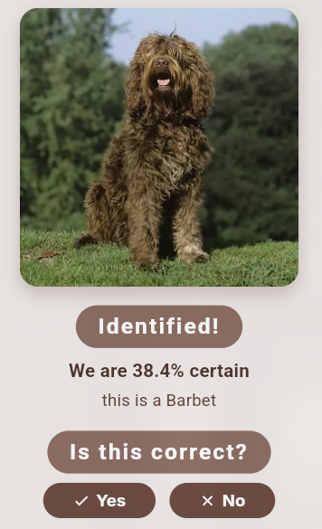
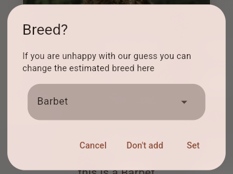

# TO EVERYONE COMING HERE FROM FLAVOURTOWN PLEASE RESIZE THE WINDOW TO BE PHONE REOLUTION, IT WILL NOT SCALE CORRECTLY OTHERWISE I CANNOT STRESS THIS ENOUGH, THE APP IS DESIGNED FOR PHONE, PLEASE RESIZE THE WINDOW

# DogDex
 

A real life Pokédex.. but for dogs!

## Overview

I'm making this [project](https://flavortown.hackclub.com/projects/11999) for the [2026 Hack Club Flavortown event](https://flavortown.hackclub.com/), I am also submitting it in the [2026 STAV Science Talent Search](https://stav.org.au/science-talent-search/).

The main two features of DogDex are identifying and tracking dogs. By pressing the large camera button in the bottom center you can either take a photo of a dog or use one from your gallery.

Your picture is then sent to my personal API for identifying dogs and a result is spit out (Images sent are not saved on the server, even for a moment).

 

You can then press "Yes" twice to add the dog to your personal collection! Or you can press "No" and either not add it to your collection or specify the breed you believe the dog to be

### Extra Usage Notes
 - Pressing the picture icon on the top bar shows all the dogs you have identified
 - There is a settings menu in the top left that allows you to change what units to use (imperial or metric) and how common the dogs on the collection page are
 - If you re-open the site too many times or process too many dogs you may get rate limited. However, you need to be actively trying to reach the limit

> [!IMPORTANT]
> This app is not designed with PC / landscape in mind if you plan to open the app on PC resize your window to phone resolution

## Design Process

- **Step 1 – Find some dogs**  
  I started by hunting for a dataset and first used [this one from Kaggle](https://www.kaggle.com/datasets/jessicali9530/stanford-dogs-dataset). Much later I swapped to [this dataset](https://hyper.ai/en/datasets/16786) which had cleaner labels and worked better for my use case.

- **Step 2 – Teaching a computer what a dog is**  
  I built a basic [neural network](https://github.com/twig46/dog_nn) to guess the breed from an image. Once I had something giving vaguely sensible results, I moved on to actually making it usable by humans.

- **Step 3 – Pick a frontend (with zero frontend experience)**  
  After about 5 minutes of deliberation I landed on  using the [Flutter](https://flutter.dev/) framework for [Dart](https://dart.dev/), even though I’d never touched either of them previously. It seemed convenient and perfect for my use case so I just started working and decided to learn as I went.

- **Step 4 – Failed experiment: on‑device model**  
  At first I tried to cram the neural network directly into the frontend app so everything ran on‑device (partially because I didn't want to have to set up an API). This did not go well. Model size, performance and general pain demonstrated that an API was the only viable option.

- **Step 5 – Backend and hosting musical chairs**  
  I built a backend in Python using [FastAPI](https://github.com/fastapi/fastapi).  
  - v1 was hosted on [Render](https://render.com/) but the “spin up” time was painfully slow and a major dealbreaker.  
  - I then moved to [Railway](https://railway.com/) for snappier response times... before eventually discovering Railway’s credit system and ditching that
  - And I then finally switched over to running it locally.

- **Step 6 – Making it not suck to use**  
  From there most of the work was:
  - Making the API safer and less easy to abuse.  
  - Iterating on the UI so the flow felt less clunky and unintuitive: big central camera button, simple “Yes/No” flow, and a collection screen.  
  - Training and tweaking the model to be less wrong.

- **Step 7 – Dog info + web version**
  I started building a “Dog Info” screen so each breed has more context than just a name.  
  I originally gave up on making a web version (Porting all the logic over seemed like a pain), but the most common Flavourtown feedback was to “make this run in the browser”, so I eventually back to it (After everything else of course). And, after a few hiccups, the web version is now working [pretty great](https://dogdex.tobyv.dev)!

## Tech

- Frontend: Flutter + Dart (mobile‑first, also runs on web)
- Backend: FastAPI (Python) wrapping the neural network
- Model: Custom dog‑breed classifier trained on public [datasets](https://hyper.ai/en/datasets/16786) and based off of ResNet-18

## Download
There is currently no download for the Android app as I am planning to release it to the Google Play Store in a week or three, please look out for that.
You can find the web version [here](https://dogdex.tobyv.dev)
I currently have little to 0 plans for a PC or iOS port however I may consider it if demand is high enough (unlikely) 
EDIT: turns out you need to pay A$150/y to develop for Apple so unless I win the lottery or something I'm not doing that.

## Contact
If you have any issues or suggestions please contact me either at [support@tobyv.dev](mailto:support@tobyv.dev) or [submit an issue](https://github.com/twig46/dogdex/issues/new/choose) on the GitHub repo.
